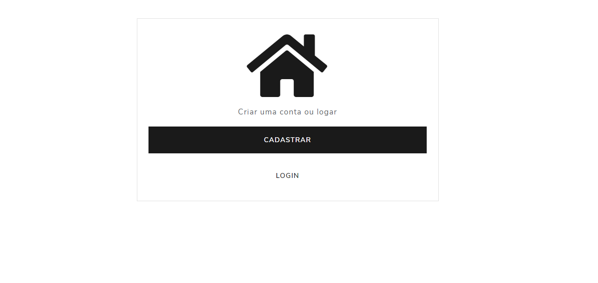
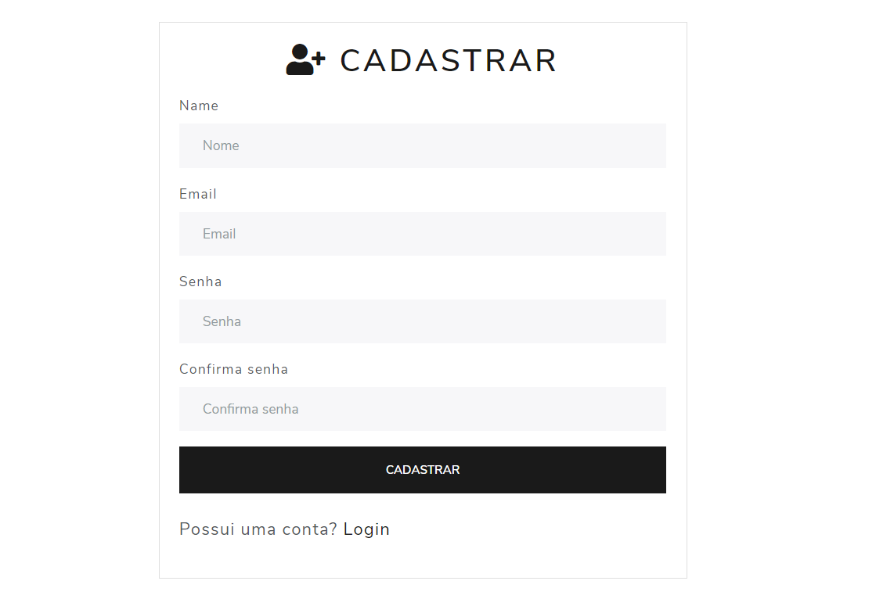

## **O Projeto**

<h4>Web</h4>

É uma aplicação web simples que realiza as quatro operações básicas (criação, consulta, atualização e destruição de dados) um CRUD.
 

## **Preview**

  

  

  

## **Tecnologias utilizadas**
<ul>
<li><h3>Node.js</h3></li>
<li><h3>EJS</h3></li>
<li><h3>Express</h3></li>
<li><h3>Bcryptjs</h3></li>
<li><h3>MongoDB</h3></li>
</ul>

by Vinicius Lima

